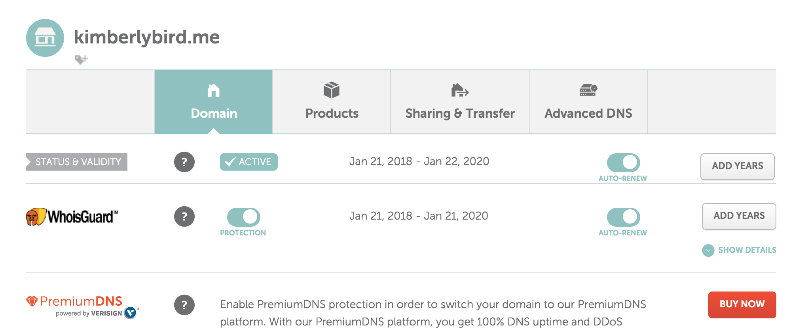

# Publishing with Github Pages

Github provides a simple mechanism to publish a static web site. By static web site, it must meet the following critieria.

1. Your site must not use XHR or `$ajax()` to load any of your site files.
1. Your site must be dependant upon a persistent database file, or system.
1. Your site must not rely upon any automation tools like Grunt, Gulp, Sass, or Webpack to operate.

The [Github documentation for publishing](https://help.github.com/articles/configuring-a-publishing-source-for-github-pages/) is easy to follow, so we won't regurgutate the information here.

## Deploying to Github Pages with a custom domain
If you would like to use your own domain, rather than the default `github.io` domain, you can follow these directions.

Inspired by [this post](https://medium.com/employbl/launch-a-website-with-a-custom-url-using-github-pages-and-google-domains-3dd8d90cc33b).

Before getting started, we are assuming you have the following completed:
1. Static personal website (see above criteria)
1. Github repo created
1. Domain purchased (www.namecheap.com is a common one but any will do. These directions will show with a domain purchased on namecheap)

## CNAME
Create a CNAME file (at the same level as my index.html)

In the CNAME file, add the domain you purchased

Add, commit, and push those changes up to Github

## Set up Github repo with your new domain

Go to settings in your personal site repo

Scroll down to Github Pages and select main branch” as the source for your Github pages

Under “Custom Domain”, enter in your domain where Github pages should serve the Github pages

## Configure DNS
Log into your domain and navigate the DNS section

For Namecheap,
Login and go to your dashboard
Click “manage” for the domain you need to configure

Click “Advanced DNS” near the top

Under “Host Records”, you’ll be adding 3 new records:

The Github settings are the same for everyone
1. Type: A Record
1. Host: @
1. Value: 192.30.252.153
1. Value: 192.30.252.154

Your CNAME entry:
1. CNAME Record
1. Type: www
1. Value: [your-github-repo-name].github.io

Voila! You should be deployed!

Whenever you make changes to your personal site, as long as you merge those changes into main, they will be reflected on your domain (sometimes takes a minute, but not that long)

