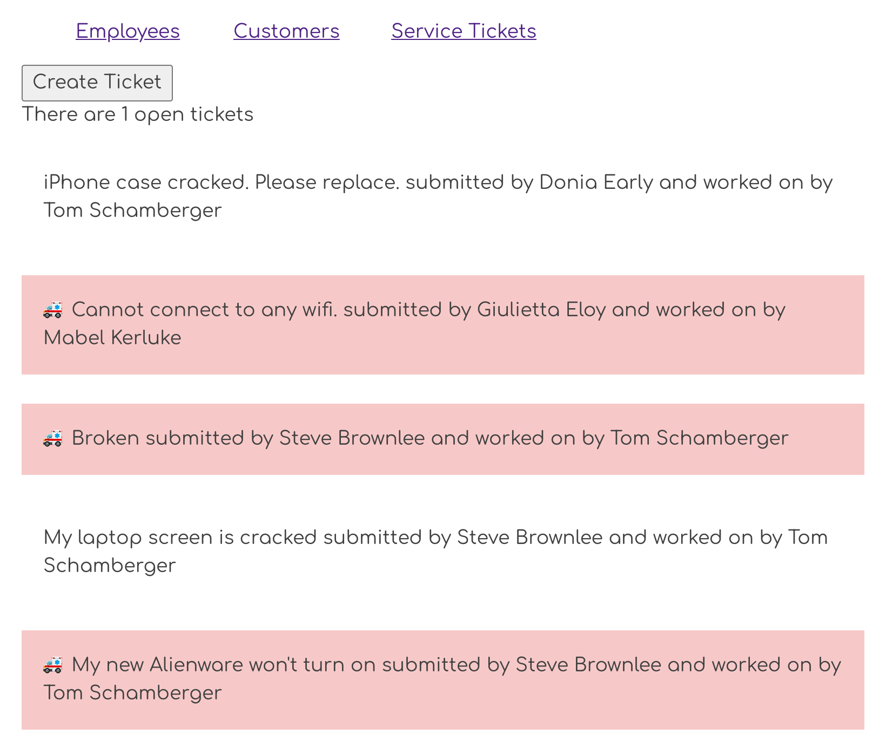

# Conditional Rendering of Emergencies

## Goal

In this chapter, you are going to augment the component that displays the list of service tickets so that emergency tickets are rendered with a different style than non-emergencies. You will use ternaries to perform this conditional rendering.



## Ticket Stylesheet

Create a `Tickets.css` file in the appropriate directory and import it into the `TicketList` module. Create a `.emergency` rule in the CSS and define a light red background color property.

## JSX Ternaries

In VanillaJS, you used ternary statments inside of string templates to use a logical condition to determine the contents of it. You can do the same thing in your JSX. You just don't need to preface it with a `$` if it is a JSX conditional.

However, if you want to write a ternary inside a regular JS string template, you need the `$`. You will use both formats.

First, copy the code below and replace the corresponding code in the module. You should now see the ambulance emoji in front of emergency tickets.

> ##### `src/components/serviceTickets/TicketList.js`

```js
<p className={`ticket`}>
    {ticket.emergency ? "🚑" : ""} {ticket.description} submitted by {ticket.customer.name} and worked on by {ticket.employee.name}
</p>
```

## Practice: Seeing Red

Currently, only the `ticket` CSS class is applied to each paragraph element. Write a ternary condition in the string template to apply the `emergency` CSS class if the ticket is an emergency.

