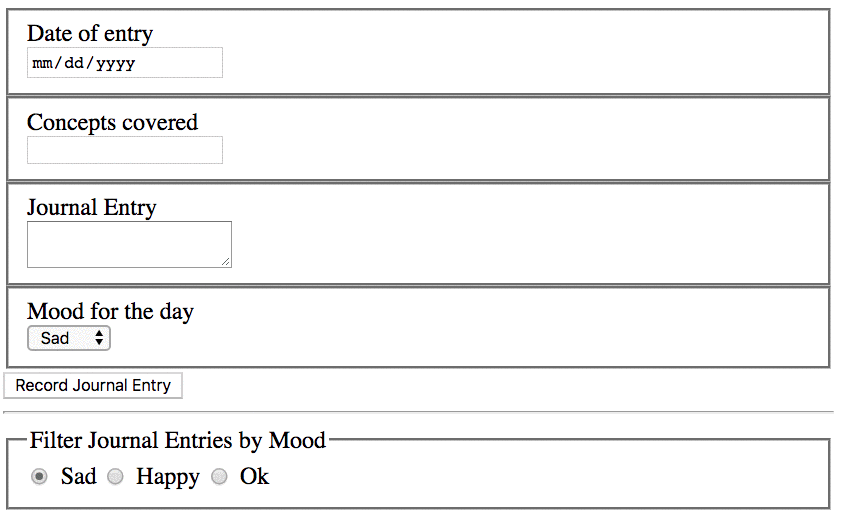
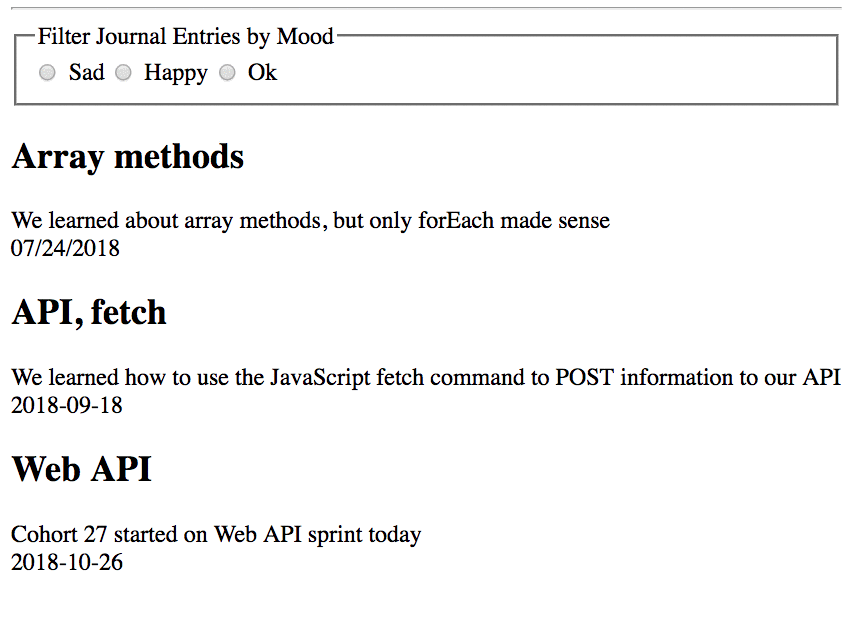

# Daily Journal

The learning objective for this chapter is to use radio buttons, apply your knowledge of event listeners, the `filter()` method on an array, and the `find()` method on an array to show journal entries that match a certain mood.

> **Warning:** This part of Daily Journal development will  stretch your understanding of how each of the components can be used together in a non-sequential way. If you get frustrated by not being able to **immediately** see how it all works, that's natural and normal. See your instruction team.

## Mood Radio Buttons

Using `<fieldset>`, `<legend>`, `<input type="radio">`, and `<label>` HTML components, construct a set of radio buttons for selecting one of the moods. It's important that each of the radio buttons has the same value for the `name` attribute, but each should be a different value for the `value` attribute.

Before you go to the instruction team for help on this section, make sure you use the [Mozilla Developer Network article](https://developer.mozilla.org/en-US/docs/Web/HTML/Element/input/radio) on radio buttons as a reference first.



## Filter Bar Component

The fieldset that has the sad, happy, and ok radio buttons in it is a component. Make a  **`MoodFilter`** component. Here's an example.

> #### `daily-journal/scripts/filter/MoodFilter.js`

```js
// Event listener will go here

export const MoodFilter = () => {
    // Get all the moods from the database


    // Build the HTML string for the radio buttons
    return `
        <fieldset class="fieldset">
            <legend>Filter Journal Entries by Mood</legend>
            ${
                allMoods.map(
                    (mood) => {
                        return `<input type="radio" name="moodFilter" value="${ mood.id }"/>
                        <label for="moodFilter--happy">${ mood.label }</label>
                        `
                    }
                ).join("")
            }
        </fieldset>
        `
}
```

## Add Event Listener

1. Add an event listeners that captures when your radio button group changes
2. Set transient state to store the user choice _(you'll need a setter function)_
3. Dispatch state changed event
4. In your article list, only render the articles that have the matching mood



A radio button group acts just like a `<select>` element. When the user clicks on one of the options, it generates a "change" event which you can capture on the event hub.

Then you can check the name property of the event target to make sure the logic only runs when the user has selected a mood.


```js
eventHub.addEventListener("change", e => {
    if (e.target.name === "moodFilter") {

    }
}
```

## Filtering the Journal Entries

Once you have successfully retrieved the value of selected mood, you need to filter all of the journal entries.

Consider adding a state variable that tracks which entries should be displayed. The user can either view all entries, or a filtered list of entries.
