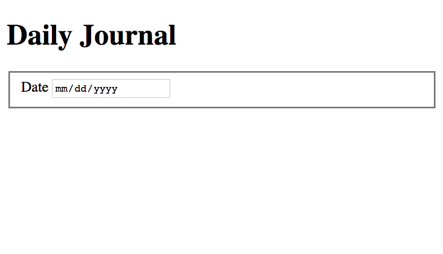
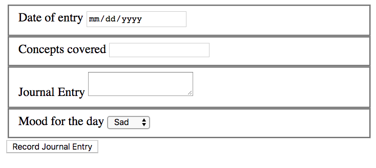

# Daily Journal Semantic HTML and Layout

Use your wireframe as a guide to create the HTML for your daily journal.

## Project Directory and First Files

1. Create a new sub-directory in your `workspace` directory named `daily-journal`.
1. In that directory, create an `index.html` file.
1. Create a sub-directory named `scripts`. This directory will contain all of your JavaScript files in the future.
1. Create a `styles` sub-directory and create a `main.css` file in it.

Once those are created, make sure you are in your root directory and open Visual Studio Code with the `code .` command in the terminal. Once it launches, you are ready to start coding.

### Boilerplate HTML Code

Open your `index.html`. Visual Studio Code provides many shortcuts and can write boilerplate code for you, which you then customize for your needs. Just type in the letters `html` and in the Intellisense context menu that appears, choose the "html:5" item to get some boilerplate HTML.

Inside the `<head>` tag, create a new line, type in `link` and choose the "link:css" item and change the href to `main.css`

## HTML Layout

Refer to your wireframe and write semantic HTML for the page.

* Start broad with `<header>`, `<main>` and `<footer>`.
* Get more specific with `<section>`, `<article>`, and `<form>`. (Don't worry about the details of the form - you will build that out below).
* Get more specific with `<h2-h6>`, `<p>`, and `<a>`.
* Continue this process until you block in the page with all of the details from your wireframe.


## Build the Journal Form

You are going to use the `form` component, the `fieldset`, `label`, `input`, `textarea`, `select`, and the `option` elements to build your form.

The first step is to create a date field.

```html
<main id="container">
    <form class="entryForm">
        <fieldset>
            <label for="entryDate">Date</label>
            <input type="date" name="entryDate" class="entryForm__date">
        </fieldset>
    </form>
</main>
```

Then create an `<h2>` element above the form containing the text _Daily Journal_.

Save your file. Go to the terminal. Type in `serve`. You should see something like this.



## Create the Remaining Fields

Now you create the rest of the fields using HTML elements. When you are done, the form should look simlar to this.




## Column Layout with Flexbox

Now use the `display: flex`, and `flex-direction: column` CSS properties to change your form to look like this.


## List Element

After your form HTML, but before the closing `</main>` tag, add the following article element. You will be using this element in later chapters to display your journal entries.

```html
<article id="entries"></article>
```
