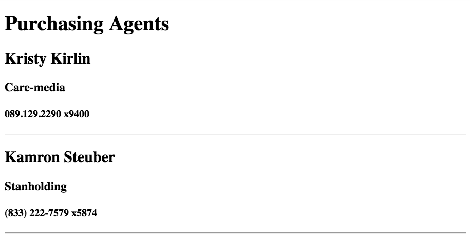

## Converting Existing Data to Another Format

> Doris sidles up next to you after your lunch break, holding a cup of herbal tea. She takes a quick sip, inhales deeply and says, "I love everything you've done so far. This is making a huge difference in everyone's productivity."
>
> You're fairly sure that by _everyone_, she means herself, but you nod, smile and respond, "Thank you. Just glad to be making a difference."
>
> Doris smiles back and says, "Now that I have a list of businesses, I realize that I would also love to have a list of purchasing agents. All by themselves. On a web page like the business names."

To achieve this task for Doris, you still need to iterate the original array of businesses, but all you need is the purchasing agent names. If you can extract those names and put them in their own array, then you can use `.forEach()` to display them in the DOM.

The `.map()` method is perfect for that. The map method is used for transforming items in one array to a different structure, and storing the new items in another array. Here's how you would do that for art supplies if you wanted an array that only contained the brands that you sell.

> **`just-for-show/scripts/exampleDatabase.js`**

```js
const database = {
  supplies: [
      { id: 1, price: 12.99, color: "Red", brand: "Bloomfield", type: "Paint" },
      { id: 2, price: 75.49, color: "Brown", brand: "Illinois Art", type: "Easel" },
      { id: 3, price: 19.99, color: "White", brand: "Emerson", type: "Oil Paint Canvas" }
  ]
}

/*
    Responsibility:
        Generate an array that contains the brand of each supply

    Parameters:
        None

    Returns:
        (array) - Array containing only brand strings
*/
export const brandNames = () => {
    // Generate a new array based on original array using .map()
    const onlyBrands = database.supplies.map(
        // Callback function to handle each supply object
        (supply) => {
            return supply.brand
        }
    )

    // Return the new array of strings
    return onlyBrands
}
```

## Videos With More Examples

You can watch some videos where other developers show you other examples of how to use the `.map()` method on an array.

* [.map() Array Method | JavaScript Tutorial](https://www.youtube.com/watch?v=P4RAFdZDn3M)
* [JavaScript Array Map](https://www.youtube.com/watch?v=G3BS3sh3D8Q)

## Task: Listing Purchasing Agent Names

1. Create a new module named `AgentList.js`
1. Build a function named the same inside it that uses `.map()` to generate an HTML representation of each purchasing agent. Display the agent's name, company, and phone number.
1. Then use the `.join("")` method to concatenate all of the individual strings into a single string.
    ```js
    const agentHTMLRepresentations = businesses.map(
        // Your callback function goes here
    )
    const finalHTML = agentHTMLRepresentations.join("")

    return finalHTML
    ```
1. Invoke the function in the correct place in `main.js` to view your results on the DOM.

    
